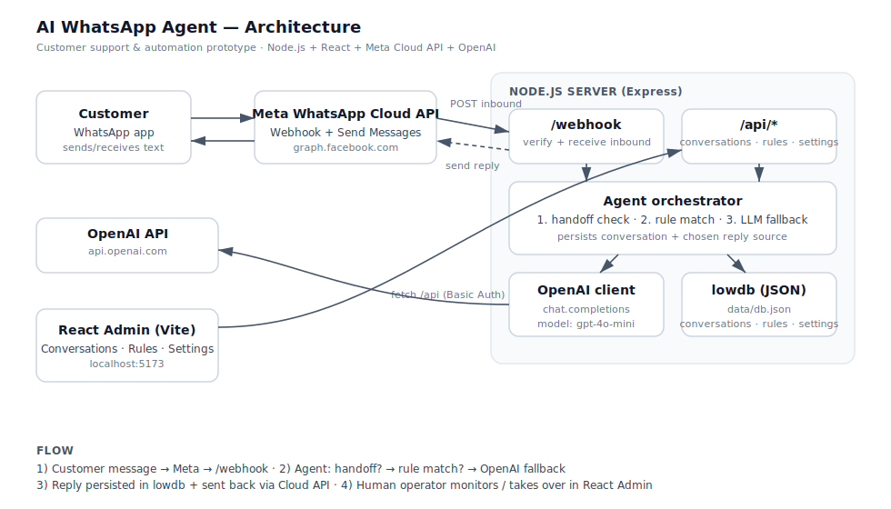

# AI WhatsApp Agent — prototype

An AI-powered customer support agent for WhatsApp.
Built as a prototype for an Upwork pitch — fully runnable in **mock mode** without any Meta or OpenAI credentials.

- **Backend:** Node.js + Express, lowdb (JSON file)
- **Frontend:** React + Vite + Tailwind (CDN)
- **AI:** OpenAI Chat Completions (`gpt-4o-mini` by default)
- **Channel:** Meta WhatsApp Cloud API (Graph API `v20.0`)

## Features

- Meta WhatsApp Cloud API webhook (verify + receive) and outbound send
- Agent orchestrator: handoff check → keyword rule → OpenAI fallback (last 10 turns of context)
- Admin console
  - Conversation inbox + human-takeover
  - Auto-reply rule CRUD
  - System-prompt editor and handoff-keyword config
  - Built-in webhook simulator (works without Meta)
- `MOCK_MODE=true` for credential-free demos
- Basic Auth on admin API

## Quick start

```bash
# 1. Install everything (root + server + admin workspaces)
npm run install:all

# 2. Configure
cp .env.example .env
# leave MOCK_MODE=true for the first run

# 3. Run (two terminals)
npm run dev:server   # http://localhost:3000
npm run dev:admin    # http://localhost:5173
```

Default admin credentials: `admin` / `admin` (change in `.env`).

In the admin console open the **Simulator** tab and send a test message — `What are your business hours?` matches a seeded rule and replies instantly.

## Going live

1. Create a Meta app, add the **WhatsApp** product, grab the test phone number ID and a permanent access token.
2. Fill `WHATSAPP_PHONE_NUMBER_ID`, `WHATSAPP_ACCESS_TOKEN`, and a strong `WHATSAPP_VERIFY_TOKEN` in `.env`.
3. Point the Meta webhook to `https://your-host/webhook` with the same verify token.
4. Set `OPENAI_API_KEY` and flip `MOCK_MODE=false`.
5. Restart the server.

## Architecture



```
Customer ─ WhatsApp ─ Meta Cloud API ──► POST /webhook
                                         │
                                         ▼
                              Agent orchestrator
                              1) handoff?  2) rule match?  3) OpenAI
                                         │
                              ┌──────────┼──────────┐
                              ▼          ▼          ▼
                          OpenAI       lowdb     send via
                                                  Cloud API
React Admin ──────► /api/*  (Basic Auth)
```

## Project layout

```
ai-whatsapp-agent/
├── package.json           # workspaces (server, admin)
├── .env.example
├── server/
│   └── src/
│       ├── index.js
│       ├── middleware/basicAuth.js
│       ├── routes/        # webhook, conversations, rules, settings
│       ├── services/      # whatsapp, openai, agent (orchestrator)
│       └── store/db.js    # lowdb
├── admin/
│   ├── vite.config.js
│   ├── index.html
│   └── src/
│       ├── main.jsx
│       ├── App.jsx
│       ├── api.js
│       └── pages/         # Conversations, Rules, Settings, Simulator
└── docs/
    ├── architecture.svg
    ├── demo-script.md
    └── upwork-proposal.md
```

## Endpoints

Public (Meta):
- `GET  /webhook` — Meta verification (`hub.challenge`)
- `POST /webhook` — inbound message handler
- `POST /webhook/simulate` — local-only, used by the admin Simulator tab

Admin (Basic Auth):
- `GET/POST /api/conversations`, `GET /api/conversations/:id`,
  `POST /api/conversations/:id/reply`, `POST /api/conversations/:id/handoff`
- `GET/POST/PUT/DELETE /api/rules[/:id]`
- `GET/PUT /api/settings`
- `GET /health` (no auth)

## Notes for production

- Swap lowdb for Postgres (a single `conversations` + `messages` + `rules` schema).
- Add `X-Hub-Signature-256` HMAC verification on the webhook (raw body is already captured).
- Replace Basic Auth with proper sessions / OIDC.
- Add per-rule scheduling (business hours), per-customer rate limits, and `/templates` support for proactive sends.

## License

MIT — prototype delivered as a starting point for a paid engagement.
